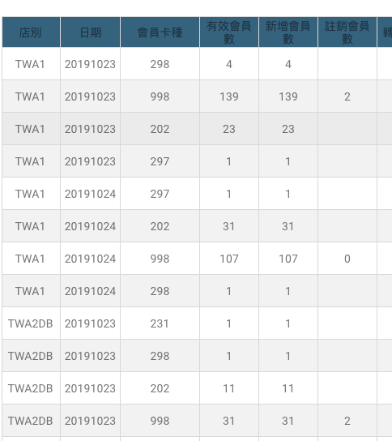

# sort

### 只照店別排，日期會亂

```javascript
responseData = responseData.sort(function (a, b) {
    return a.iss_merchant_id > b.iss_merchant_id ? 1 : -1;
})
```

### 按照 店別＋日期 排序

```javascript
responseData = responseData.sort(function(a, b) {          
    if (a.iss_merchant_id === b.iss_merchant_id) {
        // Date is only important when iss are the same
        return a.active_date - b.active_date
    }
    return a.iss_merchant_id > b.iss_merchant_id ? 1 : -1
})
```

### 排序結果



先照店別（iss\_merchant\_id）排序 ，再加上日期（active\_date）

